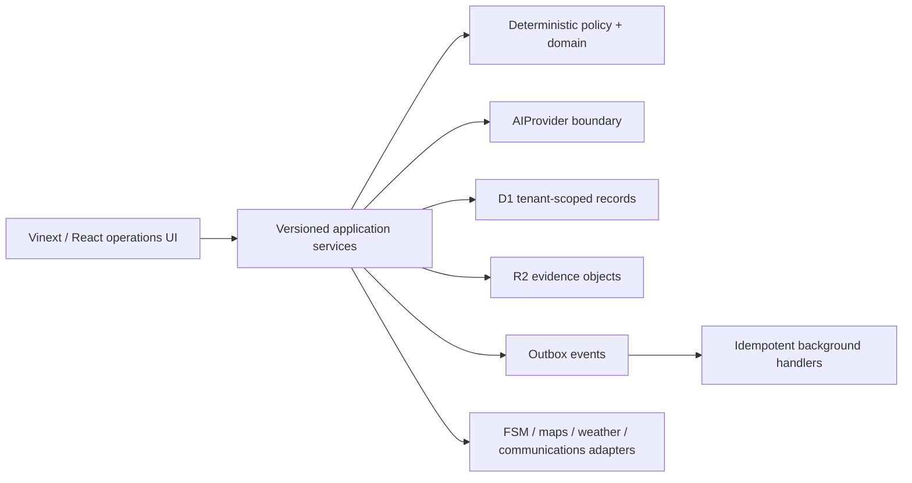
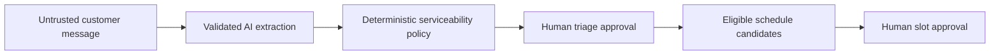
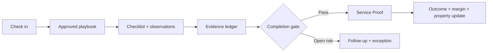
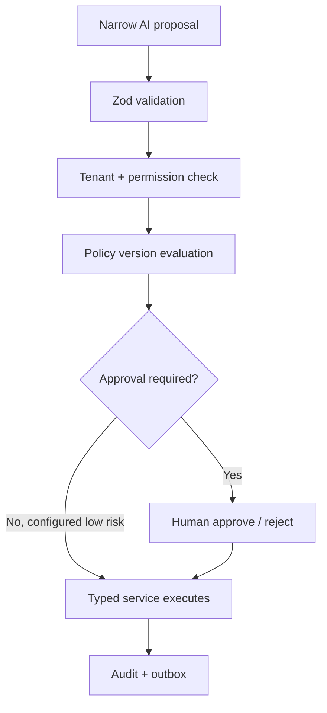

# Architecture

The web app is a Cloudflare Worker-compatible ESM deployment. Business calculations live in `packages/domain`; provider contracts live in `packages/ai` and `packages/integrations`. Tenant-owned tables include `organization_id`. The API never trusts a client-supplied tenant without reconciling it to the authenticated membership.

## Service request workflow

## Job completion workflow

## AI action approval

