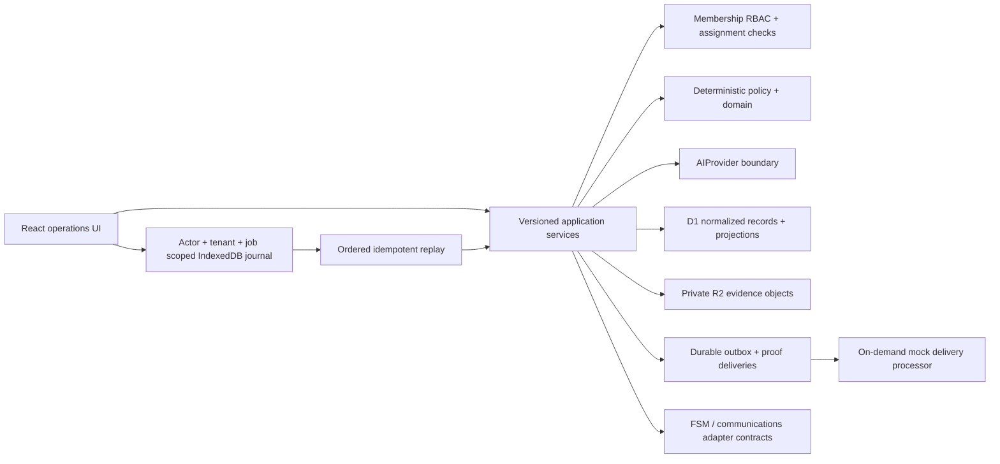
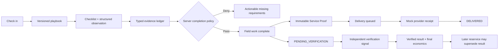

# Architecture

The web app is a Cloudflare Worker-compatible ESM deployment. Business
calculations and policy live in `packages/domain`; the workflow state machine
and proof-delivery policy live in `packages/application`; provider contracts
live in `packages/ai` and `packages/integrations`; and browser durability lives
in `packages/client`.

## Sources of truth

- D1 is authoritative for users, memberships, operational records, workflow
  versions, outcomes, economics, audit, outbox, delivery, and integration state.
- R2 is authoritative for private evidence bytes; D1 retains the tenant,
  assignment, semantics, object key, content type, and SHA-256 metadata.
- The versioned workflow snapshot is the current UI projection for the pilot.
  Normalized records are written with it for operations and analysis.
- IndexedDB contains only unconfirmed operations and attachments plus replay
  receipts. It cannot complete a job, generate authoritative proof, or verify an
  outcome.

Every tenant-owned query derives `organization_id` from the active membership.
Mutating APIs also derive the actor, enforce role permission, and—where
required—confirm that the linked technician matches the job assignment.

## Outcome and proof lifecycle

Completion proves the configured field process and observed facts. It does not
prove that the customer's problem is resolved. Verification is separately
authorized and attributable. Delivery truth is also independent: queued,
sending, retryable failure, final failure, and delivered are distinct states.
The normalized delivery record is durable provider truth; delivery workers are
lease-fenced, and a successful operation receipt requires the matching
workflow projection version before it can finalize.

## Offline and PWA boundary

Field operations are appended before network submission. Each journal entry has
an explicit dependency policy, stable operation ID, expected workflow version,
lease, attempt count, and recovery status. Attachments are stored with the
evidence operation. Replay uses compare-and-swap claims, monotonic server
versions, exponential backoff, authentication blocking, and explicit
human-action states for permanent errors or conflicts.

The service worker is deliberately tenant-neutral:

- personalized navigations, RSC/SSR responses, APIs, auth paths, and evidence
  are network-only and never enter Cache Storage;
- only the manifest, icon, and same-origin build assets are cacheable;
- build changes invalidate public shell caches;
- sign-out purges FieldProof caches and IndexedDB journals; and
- a cold offline navigation returns a neutral page rather than previously
  authenticated content.

## Integration and processing boundary

The local capability matrix, mock FSM, CSV support, cursor model, per-record
outcomes, receipts, retry classification, and reconciliation records are
implemented. FieldRoutes, PestPac, and GorillaDesk are declarations marked
`REQUIRES_VENDOR_ACCESS`; they are not live adapters.

Proof delivery has durable claim, receipt, retry, and dead-letter semantics but
is processed on demand through a mock communications adapter. A production
sender and scheduled worker remain external-gate work.

## Current production boundary

The Huntley loop, Playbooks, Outcomes, Integrations, membership RBAC, offline
journal, verification, reservice, economics, and operational health surfaces
are implemented for the repository pilot. The active UI still runs one seeded
job and one approved playbook version.

Production claims require live vendor credentials, a real delivery provider,
shared-tenant membership administration, design-partner field evidence,
calibrated risk/outcome policies, and formal security, privacy, accessibility,
legal, retention, backup/restore, and disaster-recovery validation.
