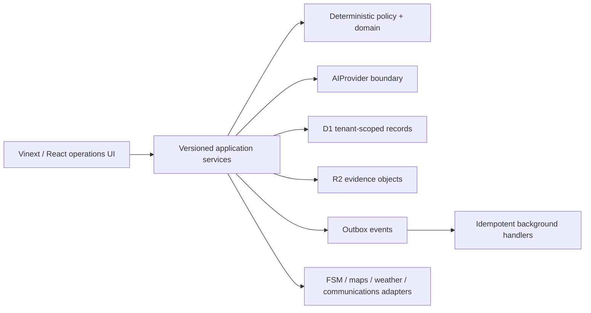
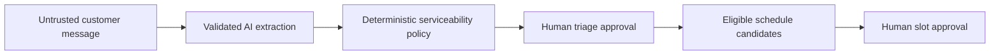
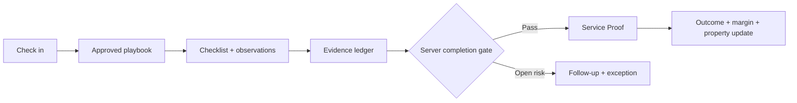
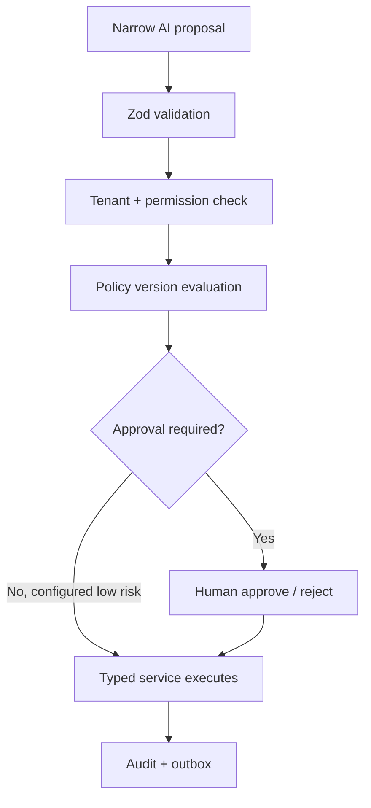

# Architecture

The web app is a Cloudflare Worker-compatible ESM deployment. Business calculations live in `packages/domain`; the server workflow state machine lives in `packages/application`; provider contracts live in `packages/ai` and `packages/integrations`. Tenant-owned tables include `organization_id`. Workflow and evidence APIs derive the pilot tenant and actor from trusted platform identity and reject client-supplied authority fields.

The Huntley pilot uses a D1 workflow snapshot with optimistic versioning, stable command identifiers, replay receipts, authoritative audit events, and outbox records. Browser state is a cache or explicitly unconfirmed offline draft; it is never sufficient to complete a job or generate Service Proof.

## Service request workflow

## Job completion workflow

## AI action approval

## Current production boundary

The request-to-proof pilot is implemented end to end. Playbooks, broad analytics, organization settings, the complete role lifecycle, and the outbox consumer remain intentionally unavailable until the pilot path is verified. D1/R2 remain appropriate for this phase; splitting into Fastify/PostgreSQL workers is not required to establish server authority.
