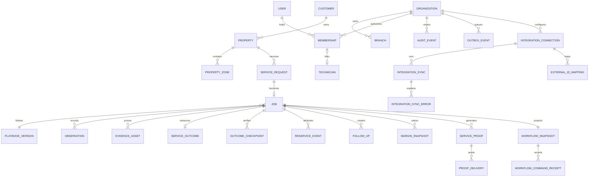

# Data model

## Implemented authoritative records

Checked-in migrations implement:

- organizations, branches, users, active/disabled memberships, technician
  links, roles, and assignments;
- customers, properties, zones, requests, immutable playbook versions, jobs,
  appointments, and schedule candidates;
- structured observations and typed evidence metadata backed by private R2
  objects;
- service outcomes, verification checkpoints, reservice links, follow-ups, and
  owned exceptions;
- expected, actual, and final margin snapshots with explicit source inputs;
- immutable Service Proof revisions and separate delivery attempts;
- proposals, audit events, outbox events, versioned workflow snapshots, and
  idempotent operation receipts; and
- integration connections, capability state, external-ID mappings, import
  batches, cursors, sync receipts, per-run reconciliation totals, and sync
  errors.

Tenant-owned records carry `organization_id`, and server APIs derive that value
from the authenticated membership. IDs from request payloads are validated
against their tenant, property, job, zone, and technician relationships before
write.

## Outcome and economics semantics

The current projection separates:

- field completion and technician assessment;
- `PENDING_VERIFICATION`;
- the independently recorded result (`RESOLVED`, `PARTIALLY_RESOLVED`,
  `UNRESOLVED`, or `CUSTOMER_UNREACHABLE`);
- subsequent reservice attribution; and
- expected, actual-at-completion, and final-after-outcome contribution.

An immutable proof hash records what FieldProof asserted at completion,
including the persisted confirmed appointment rather than a display-only
schedule candidate.
Delivery status is stored independently and becomes `DELIVERED` only after a
communications adapter receipt. A reservice preserves the earlier verification
record while updating the current result and final cost projection.

Interactive customer-confirmation entries are staff attestations: the
authenticated verifier is retained and must differ from the field completer.
`CUSTOMER_CONFIRMATION` is reserved for a future trusted customer/provider
event with its own receipt; the current workflow endpoint rejects that direct
source.

## Projection and offline model

The pilot UI reads a server-authoritative workflow snapshot plus normalized
operating records. The snapshot is optimistic-versioned and idempotent command
receipts prevent replayed side effects.

The browser's IndexedDB journal is deliberately not part of the authoritative
model. Its operation and attachment records are scoped by organization, actor,
and job, and move through queued, syncing, retry, auth-blocked, confirmed,
human-action, or cancelled states. Only a server receipt and version can confirm
them.

## Remaining scale work

The schema is multi-tenant and production-shaped, but the active workflow still
seeds one Huntley job and one service archetype. Production scale requires
generalized workflow selection, broader fixture volume, service-type policy
administration, real vendor field provenance, retention/deletion automation,
and restore validation.
