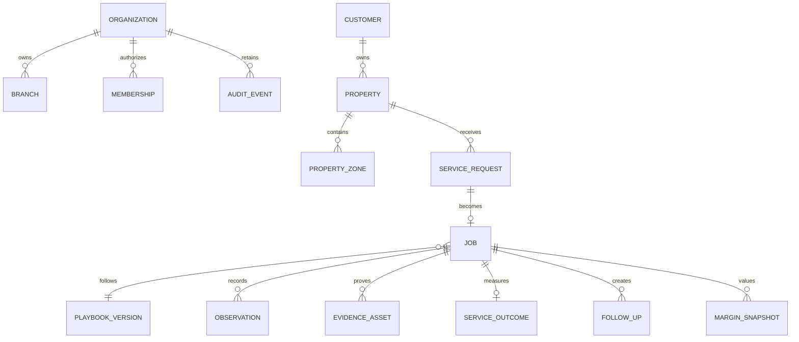

# Data model

The migration implements the vertical-slice records: organizations, branches, users, memberships, customers, properties and zones, service requests, immutable playbook versions, jobs, appointments, schedule candidates, observations, evidence, outcomes, follow-ups, margin snapshots, exceptions, proposals, audit, and outbox events.

Future normalized additions include technician availability/skills, territories, pricebook and cost profiles, route plans, notifications, integration connections and syncs, explicit approvals, recurring plans, and retention cohorts.
