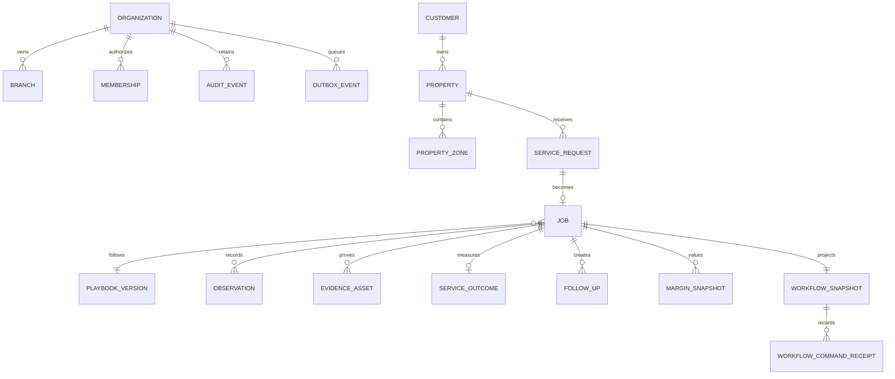

# Data model

The migrations implement the vertical-slice records: organizations, branches, users, memberships, customers, properties and zones, service requests, immutable playbook versions, jobs, appointments, schedule candidates, observations, evidence, outcomes, follow-ups, margin snapshots, exceptions, proposals, audit, outbox events, versioned workflow snapshots, and idempotent command receipts.

For the current pilot, the workflow snapshot is the server-authoritative projection used by the UI. The normalized outcome, margin, follow-up, evidence, audit, and outbox records are written alongside it. IndexedDB holds only a browser cache and clearly marked offline drafts; it is not an authoritative data store.

Future normalized additions include technician availability/skills, territories, pricebook and cost profiles, route plans, notifications, integration connections and syncs, explicit approvals, recurring plans, and retention cohorts.
