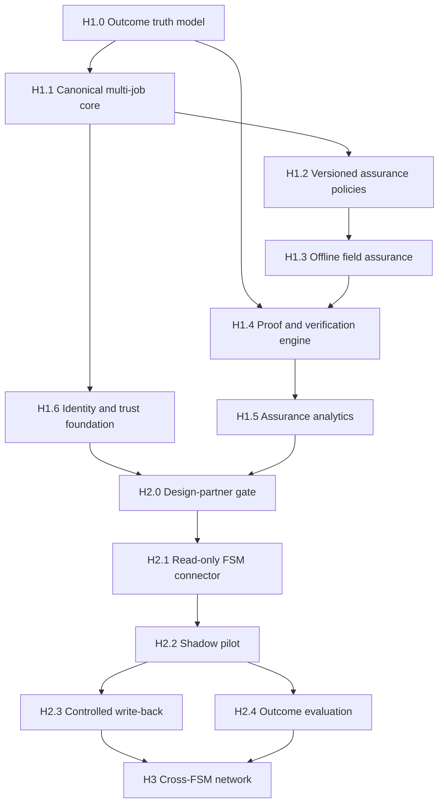

# FieldProof market-leadership master plan

Status: Active program
Plan owner: Product and Engineering
Baseline reviewed: 2026-07-24
Planning horizon: 18 months

## Executive decision

FieldProof will be the vendor-neutral outcome-assurance layer that sits beside a
field-service management system (FSM). It will not become another FSM.

The FSM remains the system of record for customers, properties, appointments,
routes, pricing, invoices, payments, accounting, payroll, and marketing.
FieldProof owns the assurance record around a service visit:

1. Was the job ready for the assigned technician?
2. Was the approved playbook followed?
3. Is the evidence complete, attributable, and durable?
4. What remained unresolved when field work ended?
5. Was the result independently verified after the visit?
6. What did the verified result contribute after reservice and warranty cost?
7. Which intervention or playbook change should improve the next visit?

This boundary avoids competing with mature routing, accounting, CRM, payment,
and call-center suites. It creates a differentiated control plane that can work
across FieldRoutes, PestPac, GorillaDesk, Briostack, Fieldwork, PestBoss, CSV
imports, and future systems.

## North star

The north-star metric is **verified-resolved contribution per technician-day**.

```text
sum(
  realized revenue
  - labor cost
  - drive cost
  - material cost
  - realized reservice and warranty cost
  for visits with a verified-resolved outcome
)
/
technician-days worked
```

A visit is `VERIFIED_RESOLVED` only when all of the following are true:

- field work passed the versioned completion-assurance policy;
- required evidence and observations are server-confirmed;
- the Service Proof contains only approved, sourced facts;
- an independent verification criterion defined by the service-type policy is
  satisfied; and
- no contradictory recurrence or reservice signal exists inside the configured
  verification window.

Independent criteria may include a customer confirmation, supervisor review,
no linked reservice during a service-specific observation window, or another
approved and attributable signal. A technician's end-of-visit assessment alone
cannot create a verified-resolved outcome.

Supporting metrics are:

- assurance coverage;
- evidence completeness;
- verification coverage;
- first-visit verified resolution;
- avoidable reservice rate;
- exception age and closure time;
- proof-delivery latency;
- outcome-adjusted contribution;
- technician capture time; and
- sync and reconciliation health.

Unknown outcomes remain `UNKNOWN`; they are not silently counted as successful
or unsuccessful.

## Product boundary

### FieldProof owns

- Canonical assurance events and state transitions.
- Immutable, versioned playbooks and assurance policies.
- Technician readiness briefs sourced from approved records.
- Required-step, observation, evidence, and unresolved-risk gates.
- Private evidence storage, integrity metadata, and attribution.
- Service Proof generation and delivery state.
- Follow-up, customer verification, recurrence, and reservice attribution.
- Human-owned exceptions and intervention recommendations.
- Outcome-adjusted margin and contribution analysis.
- Cross-FSM assurance analytics and privacy-safe benchmarks.
- AI proposal policy, approval, traceability, and evaluation.
- An authoritative audit trail for FieldProof decisions and writes.

### The connected FSM owns

- Customer, property, contract, and recurring-plan master data.
- Appointment and technician assignment authority.
- Dispatch boards, route optimization, fleet GPS, and timekeeping.
- Pricebooks, proposals, invoices, payments, refunds, and accounting.
- Payroll, commissions, marketing campaigns, and lead management.
- Telephony, AI receptionists, and general-purpose customer portals.
- Jurisdictional pesticide application and regulatory systems of record.

FieldProof may recommend a slot, flag an assignment, or calculate an assurance
impact, but it does not silently reschedule a technician. It may provide a proof
link or outcome status to an FSM, but it does not replace the invoice, payment,
or treatment record.

### Competitive implications

- FieldRoutes is strong at high-volume routing, sales, and operational
  automation. FieldProof should consume its assignments rather than reproduce
  its route optimizer:
  <https://www.fieldroutes.com/operations-suite/field-service-routing/>.
- PestPac/Wavelytics is building a near-real-time warehouse, benchmarking, and
  AI-assisted decision intelligence. FieldProof should not compete as a generic
  warehouse or natural-language dashboard. It should produce work-level,
  evidence-backed assurance events and interventions that PestPac and
  Wavelytics can consume:
  <https://www.pestpac.com/wavelytics> and
  <https://www.pestpac.com/wavelytics/decision-intelligence>.
- GorillaDesk's AI agents cover phone, SMS, web chat, and portal interactions.
  FieldProof should accept their booking or intake context and prove the
  downstream result rather than build another receptionist:
  <https://gorilladesk.com/features/ai-agents/>.
- PestPac, PestBoss, Fieldwork, GorillaDesk, and Briostack already have material,
  device, commercial, and compliance workflows. FieldProof may assure required
  evidence around those records, but it must not generate chemical or regulatory
  instructions.

## Must-win capabilities

| Priority | Capability | Market-leadership test |
| --- | --- | --- |
| P0 | Outcome truth model | Completion, technician assessment, proof, verification, recurrence, and verified resolution are distinct states with attributable evidence. |
| P0 | Completion assurance | A configured server policy prevents false completion when required steps, observations, evidence, or risk review are missing. |
| P0 | Vendor-neutral assurance ledger | The same canonical event and proof model works with fixtures, CSV, and multiple FSM adapters without leaking vendor semantics into the domain. |
| P0 | Durable offline field capture | Assigned work, evidence, and drafts survive poor connectivity and reconcile without silent loss or duplicate side effects. |
| P1 | Closed-loop verification | Customer signals and subsequent service events confirm, contradict, or leave an outcome unknown. |
| P1 | Human-owned intervention control | Every material exception has an owner, reason, due time, impact, disposition, and audit trace. |
| P1 | Outcome-adjusted economics | Expected margin is reconciled against realized labor, material, drive, reservice, and warranty cost. |
| P2 | Trusted AI assistance | AI extracts, summarizes, and proposes; deterministic policy and authorized people decide material actions. |
| P2 | Measured playbook learning | Playbook versions are compared using governed cohorts rather than anecdotal success. |
| P3 | Cross-FSM benchmarks | Operators can compare privacy-safe assurance outcomes without exposing another customer's identifiable data. |

## Current repository baseline

The present repository is a production-shaped, durable vertical slice. It now
implements the core outcome-assurance loop and its reliability/control
foundations for one seeded job. It is not evidence of production readiness,
vendor compatibility, field adoption, or market leadership.

### Completed in code

| Baseline capability | Evidence | Completion meaning |
| --- | --- | --- |
| Closed request-to-verification demonstration | `README.md`, `docs/demo-script.md` | The fictional Huntley rodent flow runs from triage through field completion, immutable proof, mock delivery, a separately authenticated staff attestation of a customer signal, reservice attribution, and final economics. Direct customer/provider verification remains an external integration gate. |
| Server-authoritative workflow | `packages/application/workflow.ts`, `app/api/v1/workflow/route.ts` | Ordered commands use optimistic versions; browser state cannot complete a job by itself. |
| Idempotent commands and evidence | `app/api/v1/workflow/route.ts`, `app/api/v1/evidence/route.ts` | Stable command and upload identifiers protect replay paths. |
| Normalized tenant identity and authorization | `db/schema.ts`, `packages/domain/authorization.ts`, `app/api/v1/request-context.ts` | Active database memberships, default-deny role permissions, and assigned-technician checks control protected actions. |
| Tenant-attributed D1 and R2 records | `db/schema.ts`, `docs/architecture.md` | Structured records carry organization scope and evidence bytes remain private objects. |
| Versioned evidence assurance | `packages/domain/evidence-policy.ts`, `packages/application/evidence.ts`, `app/api/v1/evidence/route.ts` | Uploads validate file bytes, type, SHA-256, relationships, assignment, phase, subject, capture time, and the pinned policy. |
| Completion is separate from outcome | `packages/application/workflow.ts`, `packages/domain/outcomes.ts` | Completion records actual field work and creates `PENDING_VERIFICATION`; it cannot claim resolution. |
| Proof, verification, and reservice truth | `packages/application/workflow.ts`, `packages/application/proof-delivery.ts`, `app/api/v1/outbox/route.ts` | Proof is hashed from persisted facts, delivery has reserved idempotent processing and explicit queue/receipt/failure states, the verifier must differ from the field completer, and reservice cost remains linked to a distinct child job. |
| Expected, actual, and final economics | `packages/domain/economics.ts`, `app/api/v1/operations/route.ts` | Contribution distinguishes scheduling estimates, completion actuals, and verified/reservice-adjusted results. |
| Audit, outbox, and health telemetry | `app/api/v1/audit/route.ts`, `app/api/v1/health/route.ts`, `app/api/v1/outbox/route.ts` | Audit, queue age, retries, dead letters, pending/overdue verification, delivery, integration, and build state are visible. |
| Vendor-neutral integration core | `packages/integrations/index.ts`, `app/api/v1/integrations/route.ts` | Strict capability declarations, mock/CSV behavior, cursors, per-item outcomes, receipts, retry, and reconciliation are implemented without claiming live vendor support. |
| Durable offline journal and PWA boundary | `packages/client/offline-store.ts`, `packages/client/sync-engine.ts`, `app/pwa-registration.tsx`, `public/sw.js` | Actor-scoped append-before-network operations and attachments replay idempotently; private content is network-only and cold offline uses a neutral page. |
| Enabled assurance surfaces | `components/fieldproof-app.tsx` | Playbooks, Outcomes, and Integrations expose current policy, economics/verification, reconciliation, outbox, and credential gates. |
| Safety and negative-path evaluation | `docs/ai-safety.md`, `tests/ai-evals.test.ts`, `tests/workflow-server-authority.test.ts`, `tests/offline-sync.test.ts`, `tests/integrations.test.ts` | Unsafe actions, stale/replayed writes, authorization, evidence policy, outcome transitions, integration failures, and offline recovery paths are exercised. |

### Not complete

- The active workflow, candidate set, checklist, zone, and UI selection still
  use one Huntley fixture. The 100-job/two-organization/five-archetype acceptance
  suite has not been met.
- Memberships and RBAC are enforced, but the private hosted pilot
  auto-provisions its owner. Invitation, role administration, access review,
  suspension, removal, and organization-secret lifecycle are not complete.
- One immutable rodent playbook and evidence policy are visible. Draft/publish/
  retire administration and the remaining service archetypes are not complete.
- The offline journal is implemented, but supported-device testing,
  storage-pressure policy, field performance measurement, and the full
  100-scenario acceptance run remain.
- Proof delivery uses an on-demand deterministic mock adapter. A scheduled
  production worker, approved sender, consent/opt-out handling, and provider
  delivery/bounce webhooks do not exist.
- Mock and CSV contracts, mappings, cursors, capabilities, receipts, and
  reconciliation are implemented. No FieldRoutes, PestPac, or GorillaDesk
  behavior has been verified against current documentation, credentials, or a
  sandbox.
- The Outcomes surface proves per-job state and economics; fleet/cohort
  denominators, data-quality labels, benchmark methodology, and powered outcome
  evaluation are not complete.
- The risk score uses a fixed rodent baseline and uncalibrated weights.
- Real FSM, communications, maps, weather, and remote AI providers are not
  configured.
- Formal security, accessibility, penetration, privacy, retention, legal,
  backup/restore, disaster-recovery, and field-pilot validation remain external
  production gates.

## Dependency order

Later capabilities must not be built on ambiguous outcome semantics.



## Horizon 1: assurance foundation and shadow mode

Target: 0-12 weeks.

The exit condition is a production-shaped, multi-job assurance loop that can run
beside any FSM using CSV, replayable fixtures, or manual imports. It does not
need vendor credentials and does not write into a live FSM.

### H1.0 Outcome truth model

Dependency: none. This lands first.

Deliverables:

- Keep field completion, technician assessment, open risk, proof issuance,
  verification pending, independently verified result, recurrence, and unknown
  as distinct attributable facts or states. Never restore the earlier immediate
  `RESOLVED` transition.
- Store verification criterion, source type, source ID, observation window,
  confidence, policy version, and contradiction reason.
- Make recurrence and reservice events capable of reopening an earlier outcome.
- Rename customer-facing statements so Service Proof proves performed work and
  observed facts; it does not promise resolution before verification.
- Add positive, negative, stale-event, replay, and contradictory-signal tests.

Acceptance:

- No command path can create `VERIFIED_RESOLVED` from technician input alone.
- Every verified state has an attributable independent signal and active policy
  version.
- A later reservice event deterministically supersedes a prior verified state
  while preserving its history.
- Historical and current state can be reconstructed from authoritative records.

### H1.1 Canonical multi-job core

Dependencies: H1.0.

Deliverables:

- Replace demo literals with IDs resolved from authenticated, tenant-scoped
  records.
- Support multiple organizations, branches, jobs, properties, zones, service
  types, technicians, and concurrent workflows.
- Add integration connections, external-object mappings, sync cursors,
  capability declarations, sync receipts, and reconciliation exceptions.
- Establish source-of-truth rules for each canonical field.
- Implement deterministic CSV import and replayable vendor-shaped fixtures.
- Treat schedule ranking as advisory. Appointment authority remains external.

Acceptance:

- At least 100 fixture jobs across two fictional organizations and five service
  archetypes run without hard-coded entity assumptions.
- Cross-organization reads and writes fail in API and direct persistence tests.
- Replaying an import or command produces no duplicate entity or side effect.
- Every imported field identifies its source system and last observed version.

### H1.2 Versioned assurance policies and playbooks

Dependencies: H1.0 and H1.1.

Deliverables:

- Configure required steps, observations, evidence types, zones, escalation
  conditions, proof fields, verification criteria, and observation windows by
  service type.
- Publish immutable versions with draft, approved, effective, and retired
  states.
- Require an authorized human to publish or retire a version.
- Activate a minimal Playbooks administration surface.
- Seed rodent inspection, recurring general pest, callback/reservice,
  stinging-insect escalation, and termite/WDO inspection-evidence archetypes.
- Continue to prohibit generated chemical rates, mixtures, applications,
  guarantees, or regulatory instructions.

Acceptance:

- The five archetypes are configurable without a code change.
- An in-flight job retains its assigned policy version after a newer version is
  published.
- No AI or unprivileged actor can publish a playbook.
- Every completion-gate denial identifies the missing requirement and policy
  version.

### H1.3 Durable offline field assurance

Dependencies: H1.2.

Deliverables:

- Cache the authenticated technician's assigned-day work and required policy.
- Capture checklist steps, structured observations, evidence, and risk review
  offline.
- Distinguish local draft, queued, uploading, conflict, confirmed, and failed
  states.
- Add deterministic retry, idempotency, conflict resolution, and operator
  recovery.
- Add storage-pressure, expired-assignment, reassignment, duplicate-upload, and
  interrupted-upload tests.

Acceptance:

- Zero lost drafts across 100 automated offline/reconnect scenarios.
- Zero duplicate evidence records across replay and retry scenarios.
- A reassigned or completed job rejects stale offline writes and preserves them
  for human recovery.
- Offline data cannot satisfy a server completion gate until confirmed.
- Median local field interaction remains responsive under the supported
  assigned-day payload.

### H1.4 Proof, follow-up, and verification engine

Dependencies: H1.0, H1.2, and H1.3.

Deliverables:

- Generate an immutable Service Proof from approved facts and evidence.
- Attach source IDs, policy version, creation time, and amendment history.
- Implement an outbox consumer with leasing, retry, backoff, dead-letter state,
  and idempotent mock delivery.
- Schedule verification windows and record customer, supervisor, and subsequent
  service signals.
- Add mock customer responses and recurrence events for deterministic testing.
- Create a human-owned exception when verification fails, contradicts proof, or
  expires as unknown.

Acceptance:

- Every Service Proof statement traces to an approved fact or evidence record.
- Replaying delivery cannot send or record the same message twice.
- Permanent delivery failures appear in an owned exception queue.
- At least 90% of eligible fixture visits receive a verification attempt; every
  remainder has an explicit reason.
- Unknown, verified, and recurrence outcomes are mutually exclusive current
  projections with retained history.

### H1.5 Assurance analytics and economics

Dependencies: H1.4.

Deliverables:

- Activate assurance-specific Analytics:
  coverage, evidence completeness, verification coverage, proof latency,
  exception age, verified resolution, recurrence, and outcome-adjusted
  contribution.
- Reconcile expected margin with realized labor, drive, material, reservice, and
  warranty cost when supplied.
- Separate missing data from bad outcomes.
- Add metric definitions, denominators, time windows, and data-quality labels.
- Avoid generic CRM, revenue, route, or payment dashboards.

Acceptance:

- Every displayed metric has a repository-controlled definition and test
  fixture.
- Dashboard totals reconcile exactly to authoritative events for the reference
  dataset.
- Unknown outcomes never enter the verified-resolution numerator.
- Estimated and realized economics are visibly distinct.
- A metric with incomplete inputs displays its missing-data state.

### H1.6 Identity, authorization, and operational trust

Dependencies: H1.1. It may proceed in parallel with H1.2-H1.5.

Deliverables:

- Complete organization membership, invitation, activation, suspension, role,
  and removal lifecycle.
- Implement default-deny action permissions and organization-scoped secrets.
- Add managed rate limits, secure headers, evidence retention/deletion
  controls, audit export, backup procedure, and restore test.
- Add outbox, sync, storage, database, and verification health indicators.
- Document incident, rollback, and data-reconciliation procedures.

Acceptance:

- Every protected action has allow and deny tests by role and organization.
- A removed or suspended member loses access without changing retained audit
  attribution.
- Secrets never enter client payloads, logs, audit values, or source control.
- Restore testing recreates authoritative state from the documented backup
  boundary.
- Health reporting distinguishes operational, degraded, delayed, and failed
  dependencies.

### Horizon 1 exit metrics

- 100% of completion attempts missing a configured requirement are rejected
  server-side.
- 100% of verified outcomes have an independent, sourced criterion.
- 100% of Service Proof claims are source-linked.
- 100% of externally meaningful mutations are tenant-scoped and audited.
- Zero duplicate side effects in replay suites.
- Zero silent offline draft loss in the required reconnect suite.
- Five service archetypes operate without code-specific workflows.
- P95 normal command latency is under one second in the reference environment,
  excluding evidence transfer.
- P95 proof generation is under five seconds in the reference environment.

## Horizon 2: live design-partner proof

Target: months 3-9.

The exit condition is measured operational and economic value with one design
partner and its real FSM. Read-only shadow mode comes before any write-back.

### H2.0 Design-partner definition

Dependencies: Horizon 1 exit and External Gates G1-G4.

Deliverables:

- Select one residential pest-control operator with a named executive owner,
  operations owner, technician cohort, and technical contact.
- Agree on service types, reservice definition, verification window, proof
  requirements, cost inputs, retention, consent, and pilot success criteria.
- Choose the first connector from the partner's actual FSM. If no partner is
  selected, the planning priority is FieldRoutes for the residential ICP,
  PestPac second for commercial/enterprise, and GorillaDesk for SMB reach.
- Establish a pre-pilot baseline and stepped-wedge or controlled rollout.

Acceptance:

- Signed data-processing and pilot agreements.
- Approved field mapping and source-of-truth matrix.
- At least eight weeks of usable pre-pilot outcome and reservice data, or an
  explicitly approved prospective-only evaluation.
- Named owners for sync, operations, security, privacy, and incident response.

### H2.1 Production read-only FSM connector

Dependencies: H2.0 and partner sandbox/credentials.

Deliverables:

- OAuth or scoped credential storage.
- Incremental imports, webhook verification, cursor management, rate-limit
  handling, deduplication, and reconciliation.
- Customer, property, technician, job, appointment, completion, callback, and
  reservice mappings required by the agreed pilot.
- Sync health, mismatch queue, replay, and credential-rotation procedures.
- No write-back during initial shadow operation.

Acceptance:

- At least 99.5% successful inbound event processing.
- No duplicate jobs under webhook or polling replay.
- Less than 15 minutes P95 source-to-FieldProof propagation.
- Less than 1% unmatched required records after stabilization.
- Every sync failure is attributable and recoverable.

### H2.2 Live proof and customer verification

Dependencies: H2.1 and an approved communications provider.

Deliverables:

- Branded proof delivery through approved email or SMS.
- Delivery, bounce, opt-out, response, and consent state.
- Customer confirmation and recurrence-response capture.
- Subsequent callback/reservice matching against the originating visit.
- Technician and customer usability instrumentation.

Acceptance:

- At least 85% of eligible visits reach FieldProof coverage within 30 days.
- At least 95% of covered visits produce complete Service Proof.
- Verification is attempted for at least 90% of eligible visits.
- Customer response target is at least 40%; nonresponse remains unknown.
- 100% of known callbacks/reservices are linked or explicitly marked unmatched.
- Median incremental technician capture time is under 90 seconds.

### H2.3 Controlled write-back and intervention queue

Dependencies: stable H2.1 shadow results and explicit partner approval.

Deliverables:

- Write back only approved assurance status, proof URL, exception, and verified
  outcome fields supported by the connector.
- Use outbox idempotency, reconciliation, retry ceilings, dead-letter review,
  and rollback.
- Add readiness, incomplete-proof, open-risk, failed-delivery, overdue-
  verification, and recurrence interventions.
- Give every exception an owner, due time, estimated impact, and disposition.

Acceptance:

- No duplicate external writes under replay.
- Write-back failures are visible to an owner within five minutes.
- Every external write has its source event, actor or policy, connector receipt,
  and reconciliation state.
- No appointment, price, payment, treatment, or customer-master write is added
  without a separately approved scope change.
- Median exception closure time improves at least 15% against baseline, or the
  intervention is not promoted.

### H2.4 Production AI overlay

Dependencies: sufficient approved data, AI provider credentials, security and
privacy review, and passing deterministic baselines.

Deliverables:

- Grounded request extraction, sourced technician briefs, note normalization,
  exception summaries, and plain-language metric explanation.
- Evaluation datasets for each enabled service type and action.
- Model and prompt versions, source traces, confidence, cost, latency, and
  human disposition logging.
- Deterministic fallback and provider outage behavior.

Acceptance:

- No enabled AI path can bypass tenant, permission, policy, or approval checks.
- 100% of customer-facing generated facts are supported by approved sources.
- Safety, prompt-injection, cross-tenant, chemical-instruction, and unsupported-
  claim evaluations pass at the repository threshold.
- The AI feature must outperform its deterministic/manual baseline on the
  declared task before production enablement.
- Provider failure degrades to a safe manual workflow.

### H2.5 Outcome and economic evaluation

Dependencies: at least 500 eligible visits and eight weeks of live observation.

Deliverables:

- Cohort definition and baseline comparison.
- Verified-resolution, recurrence, evidence, technician-time, exception-time,
  customer-response, and realized-contribution analysis.
- Confidence intervals and data-quality disclosure.
- Continue, revise, or stop decision recorded in the repository.

Acceptance:

The pilot advances only if it demonstrates at least one of:

- a 10% relative reduction in avoidable reservice;
- a 15% reduction in exception closure time; or
- credible annualized customer value of at least three times FieldProof's total
  operating cost.

The result must not come at the cost of a material increase in technician time,
customer complaints, unsupported claims, or unresolved safety exceptions.

## Horizon 3: cross-FSM outcome intelligence

Target: months 9-18.

The exit condition is a defensible, privacy-safe outcome network with repeatable
value across several operators and FSMs.

### Workstreams

1. **Connector portfolio**
   - Three certified FSM connectors plus CSV/SFTP ingestion.
   - Public assurance-event schema, connector test kit, and partner SDK.
2. **Privacy-safe benchmarks**
   - Service-type, property, region, and operating-model cohorts.
   - Minimum cohort size, suppression rules, consent, and provenance.
3. **Calibrated risk and intervention**
   - Predict recurrence and evidence failure by service type.
   - Recommend additional evidence, supervisor review, or follow-up with clear
     reason codes and an available human override.
4. **Measured playbook learning**
   - Governed cohorts, stepped-wedge rollout, version comparison, promotion,
     rollback, and adverse-signal monitoring.
5. **Customer, warranty, and dispute packets**
   - Shareable, permissioned evidence and outcome packets without replacing the
     FSM's invoice, payment, treatment, or regulatory record.
6. **Enterprise trust and distribution**
   - SSO/SCIM, audit export, retention controls, penetration testing, SOC 2
     readiness, incident exercises, and partner marketplace review.

### Horizon 3 acceptance metrics

- At least three live FSM connectors, ten operators, and 100,000 eligible
  visits.
- 99.9% platform availability and 99.9% successful sync processing.
- The highest-risk quintile identifies at least 60% of subsequent reservice
  events for each supported model.
- Calibration error is no greater than five percentage points by supported
  service type.
- Every recommendation includes evidence, reason codes, model/policy version,
  and a human override.
- Controlled evaluations demonstrate at least a 10% relative reservice
  improvement or 5% improvement in verified-resolved contribution per
  technician-day.
- At least 70% operator acceptance of promoted recommendations without an
  increase in customer complaints.
- No cross-operator benchmark is exposed below its approved privacy cohort.

## What can be implemented without external credentials

The following work is fully repository-controlled:

- Outcome-state and verification semantics.
- Multi-job and multi-organization workflow generalization.
- Versioned assurance policies and playbooks.
- Membership and role enforcement.
- Evidence ledger and offline conflict/retry behavior.
- Local Service Proof generation.
- Follow-up and outbox state machines with mock delivery.
- Exception ownership and service-level tracking.
- Assurance analytics over fixtures.
- Integration connection, mapping, cursor, receipt, and reconciliation schemas.
- CSV adapter and replayable vendor-shaped fixtures.
- Connector contract tests and webhook-signature interfaces.
- AI schemas, mock providers, deterministic fallbacks, safety evaluations, and
  approval policy.
- OpenAPI, audit export, metric definitions, and operational runbooks.

These can demonstrate architecture and workflow correctness. They cannot prove
vendor compatibility, field adoption, calibrated risk, or customer value.

## External gates

No phase may claim completion while its applicable external gate is missing.

| Gate | Required evidence | Blocks |
| --- | --- | --- |
| G1 Design partner | Named owners, pilot scope, success criteria, baseline period, service/re-service definitions | Live pilot and outcome claims |
| G2 Vendor/API access | Current API documentation, sandbox or test tenant, scoped credentials, webhook details, rate limits, write permission | Real connector and write-back |
| G3 Customer data and consent | Data-processing agreement, approved fields, retention, deletion, communication consent, technician cohort | Production import, proof delivery, model calibration |
| G4 Security and operations | Threat review, secrets setup, monitoring, backup/restore, incident owner, penetration-test plan | External customer traffic |
| G5 Communications | Approved sender, templates, opt-out, delivery webhooks, privacy review | Real proof and verification messages |
| G6 AI production | Provider approval, data policy, evaluation threshold, cost/latency budget, fallback | Remote AI enablement |
| G7 Legal and regulatory | Customer-proof language, evidence retention, warranty/dispute use, state-specific review, accessibility/privacy review | Regulated claims and broad launch |
| G8 Benchmark network | Multi-customer consent, minimum cohorts, suppression rules, sufficient volume, methodology review | Cross-operator comparisons |

When a gate is first used, its decision record and evidence links must be stored
under a repository-controlled `docs/gates/` path. Secrets and customer data must
never be checked in.

## Repository-controlled definition of done

A workstream is `COMPLETE` only when all applicable items below are satisfied.
Passing a demo or writing code is not sufficient.

### Scope and product truth

- The workstream ID and acceptance metrics are named in its pull request.
- Product behavior remains inside the boundary defined in this plan.
- State names, metric definitions, failure behavior, and source-of-truth rules
  are documented.
- User-facing language distinguishes completed work, technician assessment,
  verified outcome, recurrence, and unknown outcome.

### Implementation

- Domain, persistence, API, UI, audit, and outbox behavior are implemented where
  applicable.
- Schema changes have checked-in migrations and migration tests.
- Tenant and actor authority are derived server-side.
- All retries and external writes are idempotent.
- Errors are actionable and expose correlation IDs without leaking protected
  state.
- Planned, unavailable, mock, and production behavior are clearly labeled.

### Verification

The following commands pass from a clean install when applicable:

```bash
npm run lint
npm run typecheck
npm run test
npm run evals
npm run build
npm run test:artifact
npm run test:e2e
```

Additionally:

- positive, negative, replay, stale-version, cross-tenant, permission, offline,
  and dependency-failure cases are covered;
- displayed metrics reconcile to authoritative fixture events;
- accessibility and responsive behavior are verified for changed surfaces;
- security-sensitive changes receive explicit threat-model review; and
- performance is measured against the workstream's acceptance threshold.

### Operational readiness

- Health, logs, audit, alert, retry, dead-letter, reconciliation, rollback, and
  recovery behavior are documented and tested where applicable.
- No production feature depends on a mock provider.
- An external integration is not complete until sandbox behavior and
  reconciliation are demonstrated with the actual vendor.
- A customer-value workstream is not complete until the agreed live cohort and
  observation window finish.
- Applicable external gates are recorded.

### Change control

- The change is merged to the default branch.
- The progress table below is updated in the same change.
- Completion evidence names test results, migration, relevant API or UI
  surfaces, and external gate records.
- Deferred limitations and the next owner are explicit.

## Program progress

Status meanings:

- `COMPLETE`: repository definition of done is satisfied for the stated scope.
- `IN PROGRESS`: active design or implementation exists, but acceptance has not
  passed.
- `PENDING`: work has not begun or is waiting on a dependency.
- `BLOCKED`: a named dependency or external gate prevents further progress.

| Program item | Status | Evidence or next gate |
| --- | --- | --- |
| B0 Durable Huntley request-to-verification pilot | COMPLETE | `README.md`, `docs/demo-script.md`, workflow/evidence/outbox APIs, normalized records, offline replay, and the current automated suites. Completion applies only to the fictional single-job, mock-provider scope. |
| B1 Market comparison and product-boundary decision | COMPLETE | Competitor findings are incorporated into this plan; FieldProof is explicitly an outcome-assurance layer, not an FSM replacement. |
| H1.0 Outcome truth model | IN PROGRESS | Code, migrations, API, UI, and tests now separate field completion, proof, pending verification, independent result, reservice, and final economics. Remaining acceptance work: explicit policy/source history reconstruction and broader contradictory/stale-event fixtures. |
| H1.1 Canonical multi-job core | IN PROGRESS | Normalized tenant records, memberships, integration connections, mappings, cursors, receipts, reconciliation, mock, and CSV contracts exist. The active workflow remains a single hard-coded job; the 100-job/two-organization/five-archetype gate is unmet. |
| H1.2 Versioned assurance policies | IN PROGRESS | The rodent job is pinned to an immutable playbook and typed evidence policy, completion denials name missing requirements, and Playbooks is enabled. Publishing administration and four additional archetypes remain. |
| H1.3 Durable offline field assurance | IN PROGRESS | Actor-scoped IndexedDB operations/attachments, dependency replay, leases, version rebasing, retry/auth/conflict states, HTTP transport, PWA registration, and private-cache controls are implemented and tested. Device/storage-pressure/performance validation and the required 100-scenario run remain. |
| H1.4 Proof, follow-up, and verification engine | IN PROGRESS | Immutable proof hash, follow-up, independent verification, reservice linkage, delivery receipts, retry/dead-letter policy, and an on-demand mock processor exist. Production scheduling, communications, consent, and full fixture verification coverage remain. |
| H1.5 Assurance analytics and economics | IN PROGRESS | Outcomes exposes expected, actual, final, and reservice-adjusted economics with the assurance timeline. Cohort metrics, exact reference-dataset reconciliation, denominators, and data-quality labels remain. |
| H1.6 Identity, authorization, and operational trust | IN PROGRESS | Database-backed membership RBAC, assignment enforcement, cross-site protection, evidence controls, and health telemetry exist. Administrative membership lifecycle, rate limits, retention/deletion, log export, incident procedures, and backup/restore validation remain. |
| Horizon 1 exit review | PENDING | Requires all remaining H1 acceptance gates, clean release verification, multiple archetypes/jobs, and repository definition of done. |
| H2.0 Design-partner definition | BLOCKED | Requires Horizon 1 exit and external evidence G1-G4. No design partner or live baseline is represented in this repository. |
| H2.1 Production read-only FSM connector | BLOCKED | Requires H2.0 and G2 vendor documentation, sandbox, and scoped credentials. |
| H2.2 Live proof and customer verification | BLOCKED | Requires H2.1 plus G3 customer consent/data approval and G5 communications approval. |
| H2.3 Controlled write-back and interventions | BLOCKED | Requires stable live shadow results and explicit partner/vendor authorization. |
| H2.4 Production AI overlay | BLOCKED | Optional; requires G6 and must beat its deterministic/manual baseline. |
| H2.5 Outcome and economic evaluation | BLOCKED | Requires a live design partner, at least 500 eligible visits, and eight weeks of observation. |
| Horizon 2 exit review | PENDING | Requires live outcome evidence and an explicit continue/revise/stop decision. |
| H3 Cross-FSM outcome network | BLOCKED | Requires successful Horizon 2 evidence, additional partners, and G7-G8. |

## Stop conditions

The program pauses or changes direction if:

- FieldProof cannot distinguish verified outcome from technician completion;
- the design partner cannot provide reliable recurrence or reservice linkage;
- incremental technician effort remains above two minutes without compensating
  operational value;
- proof or verification produces unsupported customer claims;
- integration reconciliation cannot prevent duplicate or stale writes;
- a pilot increases complaints, unresolved safety risk, or hidden labor;
- outcome improvement cannot be demonstrated after an adequately powered
  evaluation; or
- customers consistently demand an FSM replacement rather than an assurance
  layer.

Stopping a weak workstream is a valid program outcome. Market leadership depends
on trustworthy evidence, not the number of shipped modules.
